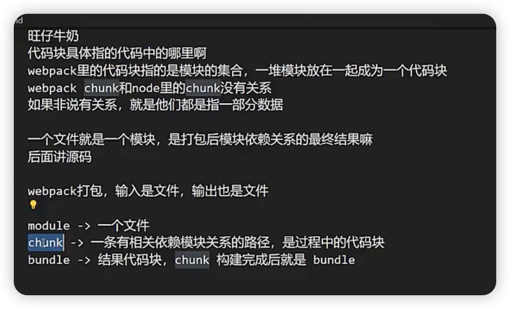
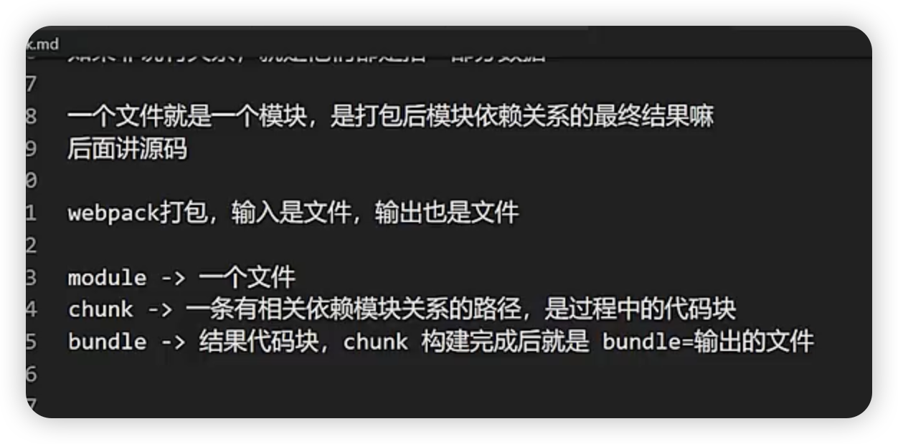

# webpack-demo


```shell
npm init -y
```

安装依赖
```shell
npm i webpack webpack-cli webpack-dev-server 
style-loader css-loader  less less-loader postcss postcss-loader 
html-webpack-plugin cross-env mini-css-extract-plugin autoprefixer @babel/core 
@babel/preset-env bable-loader typescript ts-loader @babel/preset-typescript eslint eslint-webpack-plugin eslint-confing-standard eslint-plugin-promise eslint-plugin-import eslint-plugin-node @typescript-eslint/eslint-plugin --save
```

问答




ESlint是一个流行的JavaScript 代码检查工具，旨在帮助前端开发者在编写代码时自动检查代码风格和语法错误，为了满足团队和项目代码的规范要求
ESlint 生态中出现了许多基于不同代码规范的规则集合和差劲
eslint-config-airbrnb 是Airbnb 提供的代码风格规则集，它是生态第一个成名的规则集合之一，它的优点在于提供一套完整、可自定义的代码规范，旨在帮助开发者编写具有一致性和可读性的代码
eslint-config-standard、
eslint-plugin-vue, eslint-plugin-react 插件来实现对vue文件和react文件代码风格检查

针对TypeScript 代码插件，可以使用@typescript/eslint-plugin 插件来检查代码风格和语法错误

eslint-plugin-sonarjs 插件， 该插件基于Sonar 提供了代码质量检查工具，提高团队复杂度、代码重复率等检测功能；